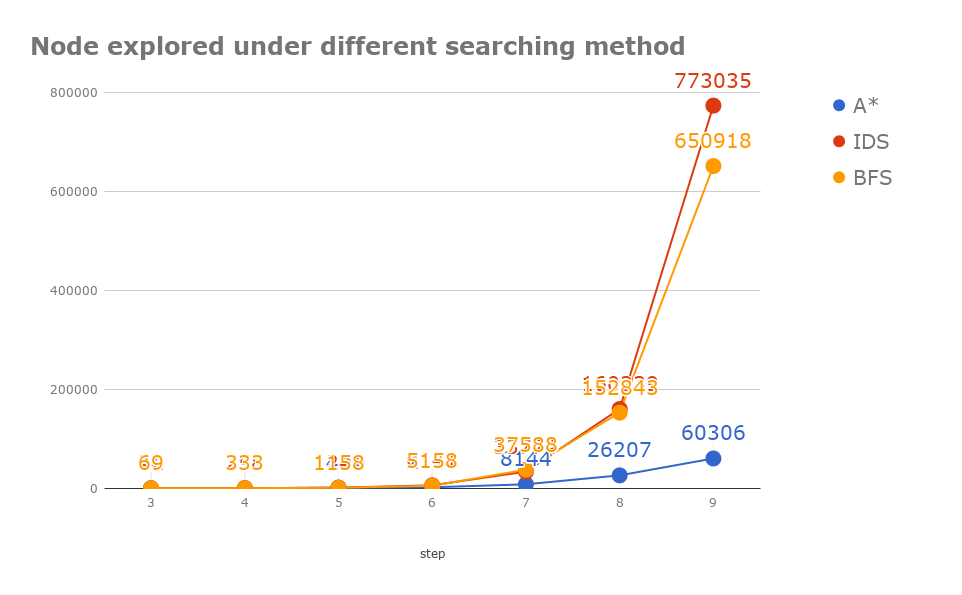
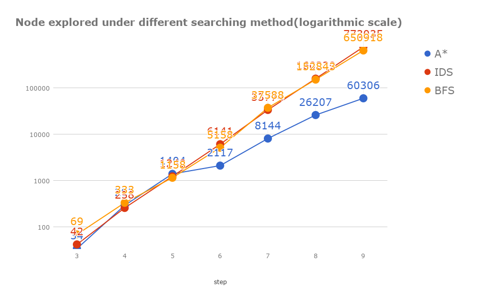

# HW1

    Introdunction to AI @ NCTU, Spring 2018
    0411276 陳奕安
    Environment: 
        OS: Arch Linux using cpython 3.6.4
        CPU: Intel i7-4790 (4C8T)
        RAM size: 16GB.

## Acheievements

**Basic requirements**

+ implemented A*, BFS, IDS serching alogorithm
+ explain the meaning of the original heuristic function given from specification

**Extra Effort**

+ build a better heuristic function
    + generate a solution table for the better heursitc one
    + find out a way to orinize the table
    + enumerate all possible input and store the outcome for later use
    + speed up the enumerated process by parallelization
+ profiling the outcome
    + write program to generate testing data

## Explanation of the original Heuristic function

$$h(n) =floor(|dx|/9)+floor(|dy|/9)$$,

As we have known, the range of the input number is limited to 0~9. The strategy used to estimate remaining steps of the searching tree is to consider the $dx$ and $dy$ seperately and sum them up at the end. 

For x ,there are only  2 situations to consider. the first one is $dx <9$, and the second one is $dx >=9$. For $dx<9$, we always estimate have at least 0 step( $floor(|dx|/9) =0$) to reach the target's x coordinate, which is simpliy true. For $dx>=9$, at least $floor(|dx|/9)$ steps is needed because the maximum possible step we can apply is 9, by counting the step with maximum step(9), we can estimate the least steps to reach the target. The explanation of y is similar.

## Build a more robust heuristic function

**Deciding the Table size**

As this game have no obvious heuristic funtion at the first sight. I decided to build a look-up table for the heuristic funtion. At first, I enumerated all solutions in 3 steps within grid points in a square, whose dialonal points are (-18,-18) and (18,18). However, the dimension of the table is way too small to have a positve effect on performance because 3 steps is way too short.
In order to reach a better performance in pratical usage, our points in grid must contain all the points in (-18,18) for 4 steps.

**Time is important**

To compute solutions under 4 steps with a single point would take 28 seconds with 1 thread.
This means to generate the table for grid points in a square with diagonal points (-18,18) and (18,18) would take 10.5 hours(1369 points).

To reduce the time for compuatation. Either reducing the points to generate or using more threads during computing process could be adopted. From the first aspect, We can only generate points in the first quadrant since the solution is symmetry about the x and y axis. Almost reduce the time by $3/4$ and by doing this, the time for compute is now theoretically reduced to 2.5hr. On the second aspect, we can apply all 8 threads in my CPU for computation. However, using 8 threads doesn't means achieve 8 times faster because there are only 4 physical cores in i7-4790, the 4 more thread comes from Intel's **Hyper-Threading** tecnology.  In my previous experience, I might only expect 5.2 times speed-up in using 8 threads, so we can limited the time for computation to 30 minutes, which is a reasonalbe outcome.

**Speeding up**

for python, we can use the `Multiprocessing` module for spawn a true multi-threaded process.

**outcome**

The outcome is : the improved hearistic function I made doesn't improved at all. I don't have sufficient time to explore the reason that read to this otucome. Still, this is a nice experiment to do. The table given below shows the profiling outcomes of A* search with different heuristic function.
The A* search in the discussion below would be he original one, the imporved one would not be shown.

|input data| node explored for original A*| node explored for imporved A*|
|:-:|:-:|:-:|
|0 1 0 0 6 6 5|1857|4264|
|0 1 0 2 8 0 1|6046|8403|
|0 1 0 2 7 7 6|10005|12407|
|0 1 0 4 8 4 9|13754|16211|

## Expected outcome

All of the search tree have branching factor B = 5. So the complexity of searching tree might be O(5^n). We expect a O(5^n) time complexity on searching.
However, different from BFS & IDS ,the actual performance of A* search depends on the heuristic funciton h(n) it used, since the goal of A* search is to improve the efficiency of BFS, we might expect a better runtime but almost same space/time complexity of it compare to BFS.

## Outcomes

Given the inputs that vary on the steps of the optimal solution,
it's shown that BFS/IDS have the similar performance. IDS have explored slighlty more nodes than BFS in order to find a solution, but in exchange, the low demand on memory usage, which can't be shown by this chart, is the reason that make IDS a more pratical algorithm while the size of the searching tree grows. On my testing environment, when the optimal solution of the input data is equal to 9 steps, BFS require 834~885 MB of memory during computation. On the other side, only 2MB of memory is used by IDS.

Changing the vertical axis to a logarithmic scale. It's shows that the 
order of growth between A* and BFS/IDS is different, in a input size that is still capable of measureing (on my computer). We can't get further information without testing a larger input set or use a mathemetic approach.

When it comes to pratical usage. For the sake of efficiency, it's better to apply IDS when the solution doesn't contains no more than 6 steps and use A* instead when it does. The question is that how can we know the steps that a solution would take before actually build a search tree on it? I suggest that __using the heuristic function in A* search to estimate the steps of a optimal solution__.

## Program structure ( not included in the 4-page limitation )

### Main script

`main.py` stand for the "main sricpt", which import the other 3 modules to perform different type of algorithm based on various inputs.

### Searching subroutine

All of the subroutines have build-in profiling functionality.

+ `bfs.py` - Breadth First Search
+ `ids.py` - Iteractive Deeping Search
+ `astar.py` - A* search, (with heuristic function)

### Basic DataStructre & functions

Common data structures for tree searching, which is specilly designed for this problem, are defined in `computeTree.py`.

In `util.py`,common functions were defined based on the data structure in `compteTree.py`, such as showing the solution using backtracking from the leaf node.

### Extra files

`table.py` is used to build all of the soultions and  all of the tables are inside in folder named `/table`.