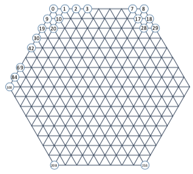
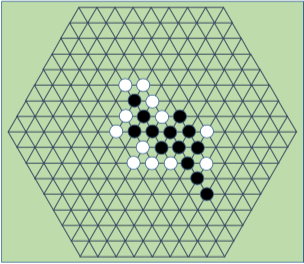

# Group Game Project

## Due 5/3/2018

The objective of this assignment is for you to design a game-playing agent. The game to be played is a variant of connect-5 on a hexagonal board.

The game board is a hexagonal shape with 9 vertices along each side, resulting in a total of 217 vertices. These vertices are indexed 0~216 as shown to the right. The game state is represented by a string consisting of "1" (occupied by the current player), "2" (occupied by the opponent), and "0" (unoccupied).

In the tournament, each pair of players will play two games, in which each player will start the game once. The "tournament points" (utilities) of the players are computed as: two points for the winner, zero point for the loser, and one point each if the game board is full while without a winner.

The overall ranking is based on the total tournament points of the players. The tie-breakers, in case multiple players have the same tournament points, are

1. Numbers of games actually won;
2. Average number of moves in the games actually won.

### About programming:
Your program should run by itself, not as a function or a library. For simplicity, the communication will be through files. Once your program is started, it should go into a loop that checks a text file for the game current game state, decides on the move, and writes the move to a text file. The files will also contain the index of the move, starting from one.

A Team ID will always be included in the filenames of files accessed by that team. The Team IDs will be assigned after the groups are formed.

The allowed programming languages / environments will be posted by the TAs, as well as the information on the input/output file formats.

The submission is to be through E3. No late submission is accepted for this project. You should submit your program source code (all in a single text file if possible) and a report file. The report (maximum 5 pages single-spaced) should describe how your game AI works, and your reasons.