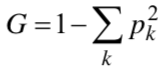

# Introduction to AI Spring 2018 Programming Assignment 3
+ Due 5/24/2018
+ The objective of this assignment is for you to experiment with supervised learning using **random forests**.
We will focus on the **classification** task. The following explains what you need to implement.

## Problem Description
You need to first implement a decision tree. Your implementation will include the **induction** part (for building the tree from the training data) and the **inference** part (for classifying new samples).

I will only provide datasets with **real-valued attributes**. As a result, use **CART** (classification and regression tree) as the base tree, which is a binary tree. No pruning is required.

When attempting to split a node, you need to select an attribute as well as a **threshold**.
The process:
+ To select a threshold for a given attribute:
    1. Let the values of the given attribute be v1, v2, ..., vn, where n is the number of samples associated with the node.

    2. For threshold selection, the easiest way is to have the values sorted such that v1 < v2 < ... < vn. Now you only need to test the following threshold values (v1+v2)/2, (v2+v3)/2, ..., (vn-1+vn)/2.

    3. For each possible threshold, divide the n samples into two groups according to the threshold.

    4. For each group, compute its Gini's impurity (here the summation is over the output classes):
        
    5. For each threshold, compute the total impurity as nAGA+nBGB. Here A and B indicate the two group of samples. Select the one threshold with the lowest total impurity. This is the threshold for that attribute.

+ Repeat the above for all the attributes (only those considered when splitting the current node; see attribute bagging), and select the one with the lowest remaining impurity for splitting the node.

The next task is to build a forest. For this, you need to implement tree bagging (bagging of samples) and attribute bagging.

You need to do some experiments with your trees/forest. Three datasets are provided (as text files) for you to test with. In addition, you can check out the **UCI Machine Learning Repository** for other datasets. (There are numerous datasets there.)

You need to divide a dataset into a **training subset** (for tree induction) and a **validation subset** (for evaluation). Be sure to do the division randomly. You can also try cross-validation, but this is not required. Report the **correct classification rates** for both the training and validation subsets.

Regarding the experiments, below are a few things you can try:

+ Relative sizes of the training and validation subsets.

+ Number of trees in the forest.

+ Parameters used during tree induction, such as how many attributes to consider at each node splitting.

+ Methods that limit a tree's size. Examples include the minimum number of samples per node, or an upper bound on the tree's depth.

+ Extremely random forest: At each node splitting, just randomly select an attribute.

+ etc.

## Submission

You submission is a report file in Word or PDF format. The report (maximum 4 pages single-spaced) should describe your experiments and results. In your report, also include a section describing your observations, interpretations, things you have learned, remaining questions, and ideas of future investigation. Include your program code as an appendix (not counting toward the 4-page limit), starting from a separate page.

The submission is to be through e3. Late submission is accepted for up to a week, with a 5% deduction per day.

You can use C/C++, Java, Python, or MATLAB to write your program. In general, the TAs will not actually compile or run your programs. The code listing is used to understand your thoughts during your implementation, and to find problems if your results look strange. Therefore, the code listing should be well-organized and contain comments that help the readers understand your code; this will also affect your grade.

## Note

Since this is a very standard algorithm, you are allowed to reference, or to use part of the existing codes on the web or from other places. The rules:
What you use have to be actual source codes, not just some library calls. For example, if you're using MATLAB, you cannot just call the toolbox functions.
Indicate the source (web links, etc.) of any part of the program that is not implemented by yourself.